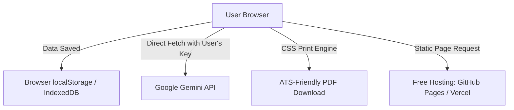

# AI-Powered Zero-Cost Resume Editor: Implementation Plan

A privacy-first, zero-operational-cost AI Resume Editor that operates entirely client-side. The app parses resumes/profiles, builds a local "User Persona" database in the browser, and uses a client-provided Gemini API Key to rewrite and align achievements with specific Job Descriptions (JDs), exporting to professional ATS-friendly PDFs.

## Architectural Strategy: Achieving $0 Operational Cost

To ensure the hosting and running costs are strictly **$0**, we will use a serverless, static-frontend approach:

1. **Static Frontend Hosting ($0)**: The application will be a single-page application (SPA) built using pure HTML, Vanilla CSS, and native JavaScript (ES Modules). It can be hosted for free on **GitHub Pages**, **Vercel**, or **Netlify** with zero build configuration.
2. **Client-Side AI Integration ($0 to Owner)**: Instead of the developer paying for LLM tokens, the app will request the user's own **Gemini API Key** (which has a generous free tier for Google AI Studio). The key is stored securely in their browser's local storage and used to make direct, secure API calls to Gemini using standard JavaScript `fetch()`.
3. **Local Storage Database ($0)**: All user data (work history, skills, generated resumes) is stored in the browser's `localStorage`, guaranteeing complete privacy and zero database costs.
4. **Client-Side PDF Rendering ($0)**: Resumes are compiled to clean HTML/CSS and exported to PDF directly via browser print engines, ensuring selectable text for ATS checkers.

---

## Proposed Technical Stack
- **Structure**: Vanilla HTML5.
- **Styling**: Vanilla CSS3 (curated variables for color system, glassmorphism, responsive flex/grid layouts, print-specific `@media print` styling).
- **Icons**: Lucide Icons loaded via CDN.
- **AI Integration**: Native browser `fetch()` API calling Google's Gemini REST API endpoints directly.
- **Data Export/Import**: JSON parser (allows users to back up their data profile to a local file).

---

## User Review Required

> [!IMPORTANT]
> **API Key Verification UX**: Since we are using a client-side API key, we should design a frictionless, friendly guide inside the app showing users how to get their free Gemini API Key in less than 60 seconds (it requires no credit card).
> 
> **Subscription Validation**: To support a yearly subscription (999 INR) or lifetime subscription (6999 INR) without database hosting costs, we can use a service like Gumroad, Lemon Squeezy, or Stripe. When the user purchases, they get a license key. The static client-side app can check this key against a free serverless function (Vercel serverless function free tier has a limit of 100k requests/month, which is more than enough for a student audience).

---

## Proposed Feature Roadmap & Components

### 1. User Profile Setup (The "Persona")
- **Base Details Form**: Simple markdown/forms for Contact Info, Education, Experience, and Projects.
- **Resume Import**: A parser that extracts text from an uploaded text/PDF file (using client-side PDF text extraction if possible) to pre-fill the forms.
- **Tech Stack Analyzer**: An LLM-powered process that scans the user's uploaded details and generates a unified, structured list of skills/tech stacks.
- **LocalStorage Sync**: Data is saved on every keypress to local storage.

### 2. Tailored Resume Generator
- **Job Description Input**: A copy-paste block where the user inserts the target Job Description (JD).
- **AI Alignment Engine**:
  - Sends the User Profile + Target Job Description to Gemini.
  - Prompts Gemini to:
    1. Select the most relevant experiences and projects.
    2. Rewrite bullet points using the **STAR method** (Situation, Task, Action, Result) focused on keywords present in the JD.
    3. Suggest tech skills to emphasize or re-order.
- **Live Preview Side-by-Side**: Split-screen showing the original details on one side and the newly generated, tailored resume on the right.

### 3. PDF Exporter (ATS-Optimized)
- A highly polished CSS print template.
- Supports single-page or multi-page formats (reordering sections dynamically to fit 1 page if requested).
- Direct "Export PDF" button that triggers the browser's native print layout (hiding UI chrome and showing only the resume template formatted perfectly for A4/Letter).

---

## Proposed File Structure

### [Component Name: Frontend]

#### [NEW] [index.html](file:///Users/vanimisettinikunj/AntiGravity Projects/Resume Editor/index.html)
The main HTML file acting as the entry point and page structure for all views.

#### [NEW] [styles.css](file:///Users/vanimisettinikunj/AntiGravity Projects/Resume Editor/styles.css)
The unified stylesheet with modern CSS variables, sleek dark/light mode UI components, and the printer layout template.

#### [NEW] [app.js](file:///Users/vanimisettinikunj/AntiGravity Projects/Resume Editor/app.js)
The core application controller, handling view routing (Profile, Tailor, Preview, License), state management, and interaction handlers.

#### [NEW] [gemini.js](file:///Users/vanimisettinikunj/AntiGravity Projects/Resume Editor/gemini.js)
Wrapper module executing LLM REST prompts (Tech stack extraction, resume tailoring, skill matching) directly from client browser with stored API key.
